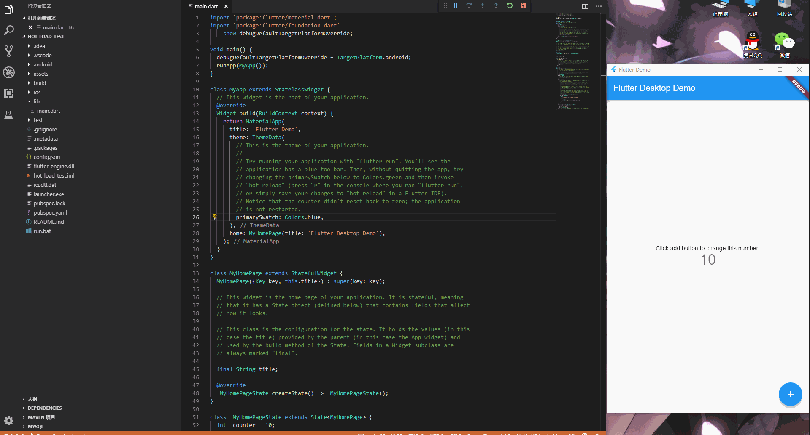
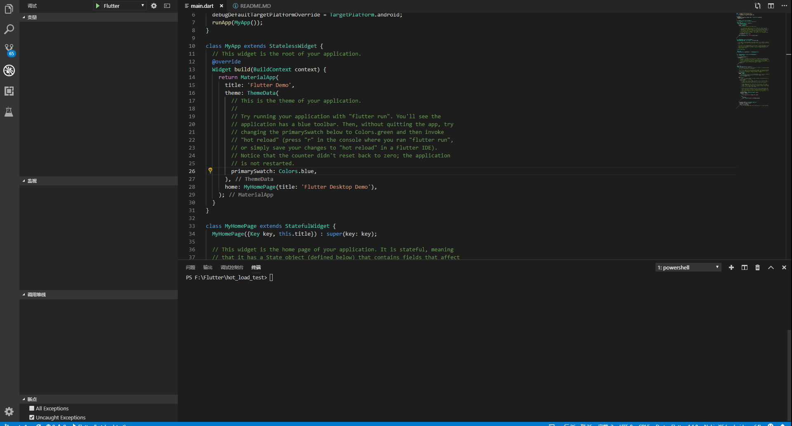

## Flutter Desktop
### Special thanks
[go-flutter](https://github.com/go-flutter-desktop/go-flutter)
### Screenshot


### Feature
- Support Hot Reload. (Test Only Visual Studio Code)
- Support Windows and Linux and Mac OS. ([go-flutter](https://github.com/go-flutter-desktop/go-flutter))
- Support window title.
- Support Text input.
- Support Clipboard. (through shortcuts and UI)
- Support Configuration file.
- More...
### Deploy
- Download release version.
- Extract the file to your path.
- Edit main method.
- Edit config.json.
```dart
import 'package:flutter/foundation.dart'
    show debugDefaultTargetPlatformOverride;

void main() {
    // must
    debugDefaultTargetPlatformOverride = TargetPlatform.fuchsia;
    runApp(MyApp());
}
```

- Run **launcher.exe**.
- Run with Visual Studio Code.
### Configuration File
```json
{
  "Width": 480,
  "Height": 800,
  "MinWidth": 480,
  "MinHeight": 800,
  "MaxWidth": 480,
  "MaxHeight": 800,
  "Ratio": 1.0,
  "Mode": 0,
  "Project": "example",
  "ARGS": [
    "--dart-non-checked-mode",
    "--observatory-port=50300"
  ]
}
```